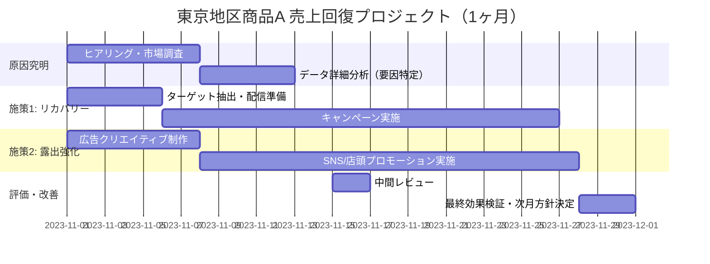

AIコンサルタントとして、ご提示いただいた分析結果に基づき、東京地区における商品Aの売上回復を最優先とした具体的施策案を提案いたします。

---

### 1. 具体的施策案

#### ① 東京地区限定：離脱顧客の「リカバリー・プロモーション」
売上25%減の主要因が既存顧客の離脱（スイッチング）にあると仮定し、直近2ヶ月で購入が途絶えた東京エリアの顧客をターゲットにした「カムバックキャンペーン」を実施します。
*   **内容:** 対象者限定の特別クーポン（サンクスオファー）の配布、または商品Aの付加価値を再訴求するパーソナライズドメールの配信。
*   **目的:** 早期に顧客を呼び戻し、売上の底打ちを図る。

#### ② 競合対抗：東京重点エリアでの「店頭・Web露出の再最適化」
東京地区で売上が急減した背景には、競合他社の攻勢やチャネル特有の問題が推測されます。特定エリア（主要店舗やオンライン上の東京セグメント）における露出を緊急強化します。
*   **内容:** 東京23区内をターゲットとしたSNS広告（ジオターゲティング）の集中投下、および主要取扱店での棚割り確保・実演販売の実施。
*   **目的:** 競合への流出を阻止し、購買接点での決定率を向上させる。

#### ③ 緊急事因分析：失注理由の「徹底解明と営業フォローアップ」
数値に現れない「現場の違和感」を特定するため、東京地区の主要取引先や販売現場へのヒアリングと、カスタマーレビューの感情分析を並行して行います。
*   **内容:** 営業チームによる「失注・減少理由」の集中ヒアリング調査と、競合価格・販促状況のベンチマーク調査。
*   **目的:** 25%減の真因（品質問題、価格競争力の低下、在庫不備など）を特定し、次月以降の抜本的な戦略修正に繋げる。

---

### 2. 実行スケジュール

売上の急落を止めるため、第1週を調査・準備、第2週から実行に移す4週間のスピードプランです。

### コンサルタントより一言
今回の25%という下落幅は、単なる市場の冷え込みではなく、**「東京地区における明確な競合要因」または「特定のチャネル不全」**が発生している可能性が極めて高いです。まず施策③で真因を突き止めつつ、並行して施策①②でキャッシュフローを確保する「止血と治療」の同時並行を推奨いたします。